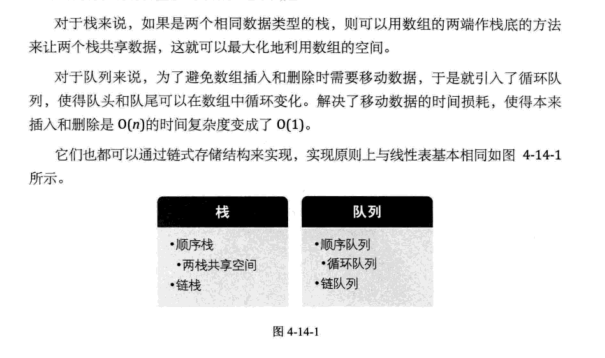

## 栈
### 栈的定义
> 栈是限定在表尾进行插入和删除操作的的线性表。

我们把允许插入和删除的一端称为栈顶，另一端称为栈底。栈又称后进先出线性表，LIFO结构。

### 栈的顺序存储结构及其实现
栈的结构定义

```
typedef int SElemType /*SEe=lmType类型根据实际情况而定，这里暂定为int*/
typedef struct
{
    SElemType data[MAXSIZE];
    int top; /*用于栈顶指针*/
}SqStack
```

我们一般用`top=-1`判断空栈
> 时间复杂度O（1）
#### 进栈操作
```
/*插入元素e为新的栈顶元素*/
Status Push(SqStack *S,SElemType e)
{
    if(S->top === MAXSIZE){
        return ERROR;
    }
    S->top ++;  /*栈顶指针增加1*/
    S->data[S->top]=e; /*将新插入元素赋值给栈顶空间*/
    return OK;
}

```

#### 出栈操作
> 时间复杂度O（1）

```
/*若栈不空，则删除S的栈顶元素，用e返回其值，并返回OK,否则返回ERROR*/
Status Pop (SqStack *S, SElemType *e)
{
    if(S->top===-1){
        return ERROR;
    }
    *e=data[S->top]; /*将要删除的栈顶元素赋值给e*/
    S->top--; /*栈顶指针减一*/
    return OK;
}
```
#### 两栈共享空间
栈的顺序存储还是很方便的，因为只准栈顶进出元素，所以不存在线性表插入和删除时需要移动元素的问题。但是它有一个很大的缺陷，就是必须事先确定数组存储空间大小，万一不够用，就需要编程后端来扩展数组的容量。对于一个栈，我们也只能尽量考虑周全，设计出合适大小的数组来处理，但对于两个相同类型的栈，我们却可以做到最大限度地利用其事先开辟的存储空间来进行操作。

做法如下：数组有两个端点，两个栈有两个栈底，让一个栈的栈底为数组的始端，即下标为0处，另一个栈的栈底为数组的末端，即下标为n-1处。这样，两个栈如果增加元素，就是两端向中间延伸。
**关键思路是：**它们是在数组的两端，向中间靠拢。top1和top2是栈1和栈2的栈顶指针。可以想象，只要它俩不见面，两个栈就可以一直使用。

可以分析出来，栈1为空时，就是top1等于-1时；而当top2等于n时，即是栈2为空时。栈满的情况有3中，第一二种是极端情况，第一，若栈2为空，top1=n-1时就是栈1满了。第二，若栈1为空，top2=0时就是栈2满了。第三种也是普通情况，两个栈见面之时，就是两个指针相差1时，即top1+1=top2为栈满。

两栈共享空间的结构的代码如下：
```
/*两栈共享空间结构*/
typedef struct
{
    SElemType data[MAXSIZE];
    int top1; /* 栈1 栈顶指针 */
    int top2; /* 栈2  栈顶指针 */
}SqDoubleStack;
```
#### 两栈共享空间插入元素
```
/*插入元素e为新的栈顶元素*/
Status Push(SqDoubleStack *S,SElemType e, int stackNumber)
{
    if(S->top1+1===S->top2){ /*栈已满，不能再Push新元素了*/
        return ERROR;
    }
    
    if(stackNumber===1){ /*栈1有元素进栈*/
        S->data[++S->top1]=e; /*先给top1+1然后赋值*/
    }else if(stackNumber===2){ /*栈2有元素进栈*/
        S->data[--S->top2]=e;   /*先给top2-1然后赋值*/
    }
    return OK;
}
```
#### 两栈共享空间弹出元素
```
/*若栈不空，则删除S的栈顶元素，用e返回值，并返回OK,否则返回ERROR*/
Status Pop (SqDoubleStack *S,SElemType *e, int stackNumber){
    if(stackNumber===1){
        if(S->top1===-1)
            return ERROR;
        *e=S->data[S->top1--];
    }else if(stackNumber===2){
        if(S->top2===MAXSIZE)
            return ERROR;
        *e=S->data[S->top2++]
    }
    return OK;
}
```

事实上，使用这样的数据结构，通常都是当两个栈的需求有相反关系时，也就是一个栈在增长时另一个栈在减少的情况。
#### 总结
适合使用共享空间栈的情况需要满足以下两个条件：
- 1、两个栈具有相同的数据结构
- 2、两个栈的需求有相反关系，一个增长时另一个减少。

### 栈的链式存储结构
栈的链式存储结构，简称为链栈。
链栈的结构代码如下：
```
typedef struct StackNode
{
    SElemType data;
    struct StackNode *next;
}StackNode, *LinkStackPtr;

typedef struct LinkStack
{
    LinkStackPtr top;
    int count;
}LinkStack;
```
#### 栈的链式存储结构-进栈操作
> 时间复杂度为O(1)
```
/*插入元素e为新的栈顶元素*/
Status Push(LinkStack *S, SElemType e)
{
    LinkStackPtr s = (LinkStackPtr)malloc(sizeof(StackNode));
    s->data=e;
    s->next=S->top; /*把当前的栈顶元素赋值给新结点的直接后继*/
    S->top=s; /*将新的结点s赋值给栈顶指针*/
    S->count ++;
    return OK;
}
```

#### 栈的链式存储结构-出栈操作
> 时间复杂度为O(1)
```
/*若栈不空，则删除S的栈顶元素，用e返回其值，并返回OK；否则返回ERROR；*/
Status Pop(LinkStack *S, SElemType *e)
{
    LinkStackPtr p;
    if(StackEmpty(*S))
        return ERROR;
    *e=S->top->data;
    p=S->top；/*将栈顶指针赋值给p*/
    S->top=S->top->next;/*使得栈顶指针下移一位，指向后一结点*/
    free(p);
    S->count--;
    return OK;
}
```

#### 栈的应用-递归
> 我们把一个直接调用自己或通过一系列的调用语句间接地调用自己的函数，称作递归函数。
#### 栈的应用-四则运算表达式求值
##### 后缀（逆波兰式）表示法定义
不需要括号的后缀表示法。例如：对于`9+(3-1)*3+10÷2`,用后缀表示法表示为`9 3 1 - 3 * + 10 2 / +`
#### 中缀表达式转后缀表达式
规则：从左到右遍历中缀表达式的每个数字和符号，若是数字就输出，即成为后缀表达式的一部分；若是符号，则判断其与栈顶符号的优先级，是右括号或者优先级**低于**栈顶符号则栈顶元素一次出栈并输出，并将当前符号进栈，一直到最终输出后缀表达式为止。

平时想让计算机具有处理我们通常的标准（中缀）表达式的能力，最重要的就是两步：
- 1、将中缀表达式转化为后缀表达式（栈用来进出运算的符号）
- 2、将后缀表达式进行运算得出结果（栈用来进出运算的数字）

## 队列的定义
> 队列是只允许在一端进行插入操作，而在另一端进行删除操作的线性表。

队列是一种先进先出的线性表，简称FIFO。允许插入的一端为队尾，允许删除的一端为队头。

线性表有顺序存储和链式存储，上面我们讲到的栈是线性表，所以有这两种存储方式。同样，队列作为特殊的线性表，也同样有这两种存储方式。

### 队列顺序存储的不足
假溢出

解决思路：循环队列

### 循环队列定义
> 队列的头尾相接的顺序存储结构成为循环队列。

问题：队列空时，`front==rear`，当队列满时,也是`front==rear`，那么如何判断队列究竟是满还是空呢？
- 1、设置标志变量flag
- 2、当队列空时，条件就是`front==rear`，当队列满时，我们修改其条件，保留一个元素空间。例如我们只允许图`p8`所示，我们就认为此队列已经满了，不允许图`p7`的出现。


接下来我们重点讨论第2种方法，有上图可知，队列满有两种情况，一是只相差一个位置，而是差一圈也就是队列的长度QueueSize-1;所以队列满的条件是`(rear+1)%QueueSize == front`

另外当`rear>front`时，此时队列的长度为`rear-front`。但当`rear<front`时，队列长度分为两段，一段是`QueueSize-front`，一段是`0+rear`，加在一起，队列长度为`rear-front+QueueSize`，因此通用的队列长度公式为：`(rear-front+QueueSize)%QueueSize`

#### 循环队列的存储结构代码：
```
typedef int QElemType; /*QElemType 类型根据实际情况而定，这里假设为int*/
/*循环队列的顺序存储结构*/
typedef struct
{
    QElemType data[MAXSIZE];
    int front; /*头指针*/
    int rear; /*尾指针，若队列不空，指向队列尾元素的下一个位置*/
}SqQueue
```
循环队列的初始化代码如下：
```
/*初始化一个空队列Q*/
Status InitQueue (SqQueue *Q)
{
    Q->front=0;
    Q-rear=0;
    return OK;
}
```
循环队列求长度代码如下：
```
/*返回Q的元素个数，也就是队列的当前长度*/
init QueueLength (SqQueueu Q)
{
    return (Q.rear-Q-front + MAXSIZE)%MAXSIZE;
}
```
循环队列的入队操作代码如下：
```
/*若队列未满，则插入元素e为Q新的队尾元素*/
Status EnQueue (SqQueue *Q, QElemType e)
{
    if((Q->rear+1)%MAXSIZE==Q->front)/*队列满的判断*/
        return ERROR;
    Q->data[Q->rear]==e;
    Q->rear=(Q->rear+1)%MAXSIZE;
    return OK;
}
```
循环队列的出队操作代码如下：
```
/*若队列不空，则删除Q中队头元素，用e返回其值*/
Status DeQueue (Squeue *Q, QElemType *e)
{
    if(Q->front==Q->rear) /*队列空的判断*/
        return ERROR;
    *e=Q->data[Q->front];
    Q->front=(Q->front+1)%MAXSIZE;
    return OK;
}
```
### 队列的链式存储结构
> 队列的链式存储结构，其实就是线性表的单链表，只不过它只能尾进头出而已，我们把它简称为链队列。
链队列的结构为：
```
typedef int QElemType; /*QElemType 类型根据实际情况而定，这里假设为int*/

typedef struct QNode /*结点结构*/
{
    QElemType data;
    struct QNode *next;
}QNode, *QueuePtr;

typedef struct /*队列的链表结构*/
{
    QueuePtr front,rear; /*队头、队尾指针*/
}LinkQueue;
```
#### 队列的链式存储-入队操作
```
/*插入元素e为Q的新的队尾元素*/
Status EnQueue(LinkQueue *Q, QElemType e)
{
    QueuePtr s=(QueuePtr)malloc(sizeof(QNode);
    if(!s) /*存储分配失败*/
        exit(OVERFLOW);
    s->data=e;
    s->next=NULL;
    Q->rear->next=s;
    Q-rear=s;
    return OK;
}
```
#### 队列的链式存储-出队操作
步骤：也就是头结点的后继结点出队，将头结点的后继改为它后面的结点，若链表除头结点外只剩一个元素时，则需将rear指向头结点。如图pp4所示。

```
/*若队列不空，删除Q的队头元素，用e返回其值，并返回OK，否则返回 ERROR*/
Status DeQueue (LinkQueue *Q, QElemType *e)
{
    QueuePtr p;
    if(Q->front==Q->rear)
        return ERROR;
    p=Q->front->next; /* 将欲删除的队头结点暂存给p，上图1 */
    *e=p->data;  /* 将欲删除的队头结点的值赋值给e */
    Q->front-next=p->next;  /* 将原队头结点后继p->next赋值给头结点后继，上图2 */
    if(Q->rear==p) /* 若队头是队尾，则删除后将rear指向头结点，上图3 */
        Q->rear=Q->front;
}
```

### 循环队列和链队列的比较

- 时间复杂度都是O（1）,不过循环队列是事先申请好空间，试用期间不释放，而对于链队列，每次申请和释放结点也会存在一些时间开销。
- 空间上，循环队列必须有一个固定的长度，所以就有了存储元素个数和空间浪费的问题。而链队列每一个结点需要一个指针域，也会有一定空间开销。总的来说，在空间上，链队列更加灵活。
**总结:**在可以确定队列长度最大值的情况下，建议用循环队列，如果无法预估队列的长度，则用链队列。



 